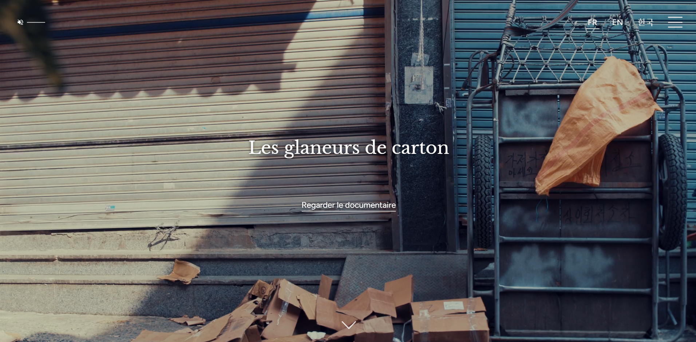

---
<h1 align="center">🎬 Les Glaneurs de Carton</h1>

<p align="center">
  <a href="https://glaneursdecarton.mastercmw.com/"></a>
  
  
  
</p>

<p align="center">
  Site web immersif pour le documentaire <b>Les Glaneurs de Carton</b>.<br>
  <a href="https://glaneursdecarton.mastercmw.com/">🌐 Voir le site en ligne</a>
</p>

<p align="center">
  
</p>

---

## 🛠️ Stack technique

| Frontend         | Backend  | Base de données | Animation | Déploiement      |
|------------------|----------|-----------------|-----------|------------------|
| HTML5, CSS3, JS  | PHP 8+   | MySQL/MariaDB   | jQuery    | Serveur mutualisé|

---

## 🚀 Installation & Lancement

### Prérequis

- Un serveur local (MAMP, WAMP, XAMPP…)
- Client base de données (phpMyAdmin, Sequel Pro…)
- Fichier de base de données `.sql`

### Étapes

1. **Cloner le dépôt**
   ```bash
   git clone https://github.com/Xuan-Minh/glaneurs-main.git
   ```
2. **Créer la base de données**
   - Créez une BDD nommée `glaneurs`
   - Importez le fichier `.sql` fourni (ex : `glaneurs (14).sql`)
3. **Configurer la connexion**
   - Ouvrir `includes/lang.php`
   - Adapter les identifiants :
     ```php
     $servername = "localhost";
     $database = "glaneurs";
     $username = "root";
     $password = "root"; // généralement "root" sous MAMP
     ```
4. **Lancer le site**
   - Accédez à [http://localhost/glaneurs-main](http://localhost/glaneurs-main) depuis votre navigateur

---

## 🗂️ Structure du projet

```
glaneurs-main/
│
├── audio/               # Fichiers audio
├── css/                 # Feuilles de style
├── font/                # Polices
├── img/                 # Images
├── includes/            # Fichiers PHP inclus (connexion, utils, etc.)
├── js/                  # Scripts JS (jQuery, etc.)
├── video/               # Vidéos
│
├── associations.php
├── derriere-le-documentaire.php
├── glaneurs (14).sql
├── index.php
├── mentionslegales.php
├── naverc5484d0d0937981e7e12f688527ddeb9.html
├── portraits.php
├── README.md
├── robots.txt
├── sitemap.xml
├── souvenirs.php
└── tracesdupasse.php
```

---

## 👤 Auteur

- **Xuan-Minh TRAN** — Développement & intégration du site web

---

## ⚖️ Licence

Ce projet utilise plusieurs licences selon les composants (code, musique, images).  
Pour plus d’informations, voir [LICENSE.md](LICENSE.md).

---

<p align="center">
  
</p>

---

N’hésite pas à contribuer, signaler un bug ou proposer des idées d’amélioration !  
Pour toute question, contacte-moi sur GitHub.

---

Si tu veux une version anglaise, d’autres badges, ou une section équipe/partenaires, dis-le-moi !